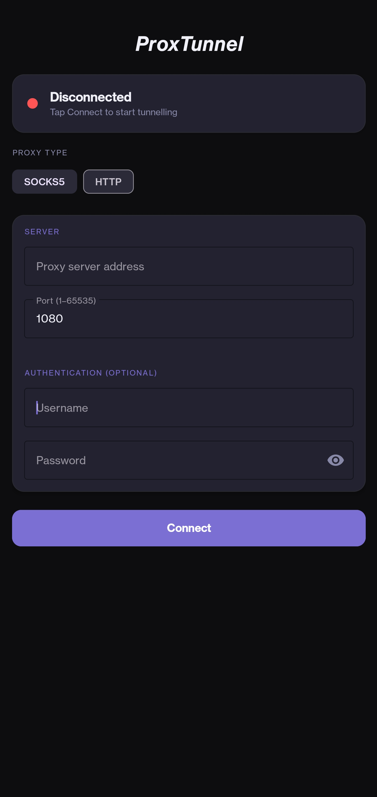
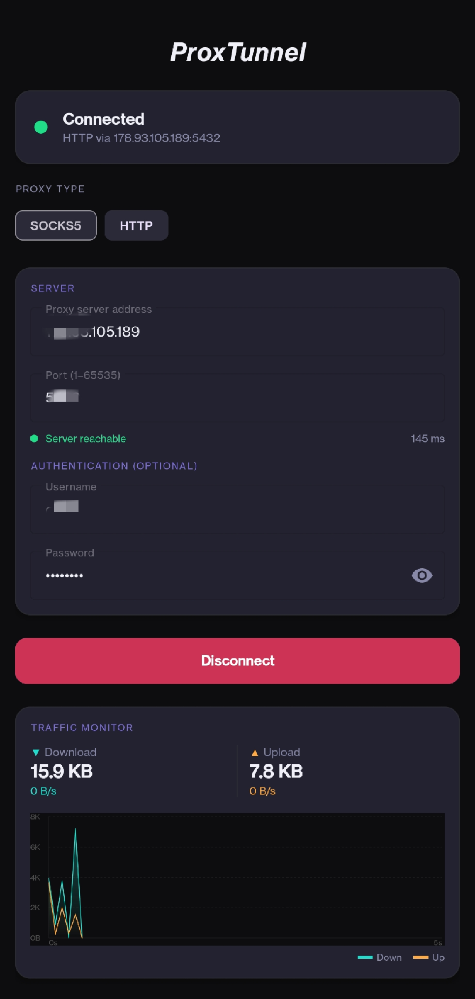

# ProxTunnel

Routes all your Android traffic through a SOCKS5 or HTTP proxy. No root needed.

<p align="center">
  
  &nbsp;&nbsp;
  
  &nbsp;&nbsp;
  
</p>

## What it does

Hooks into Android's VpnService to intercept every packet leaving your phone and push it through whichever proxy you set. Supports SOCKS5 and HTTP. Auth is optional. Tap connect, done.

## Download

Grab the APK from the [Releases](../../releases/latest) page — no Play Store, no account needed.

## Build it yourself

```
./gradlew assembleRelease
```

Needs Android Studio or the standalone SDK. Min API 26 (Android 8.0).

## Requirements

- Android 8.0+
- A SOCKS5 or HTTP proxy server

## License

MIT
